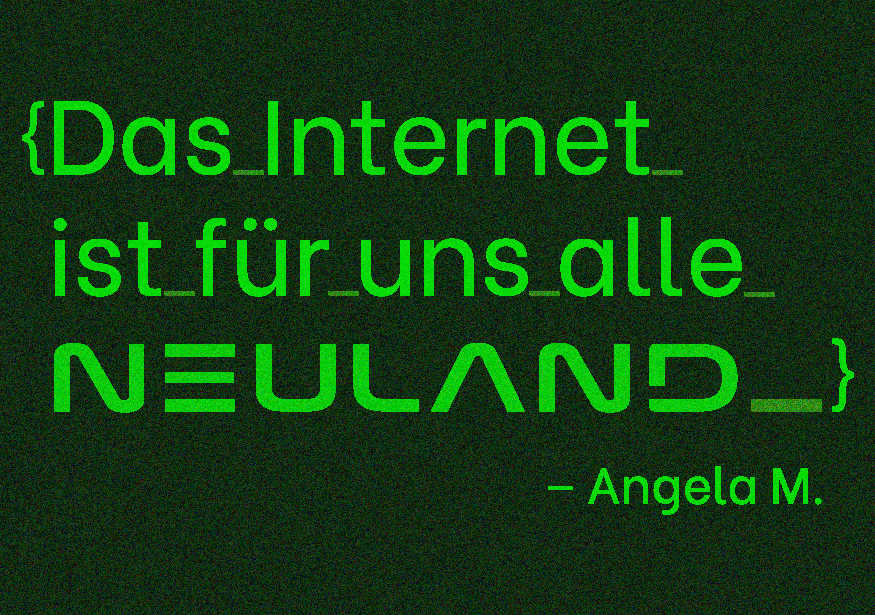

#### Based meme - Easy

*Can you help me retrieve this awsome meme?*

</br>

[based_meme.txt](based_meme.txt)

</br>

The task description tells us that we should retrieve a meme from an email that somehow got corrupted. As the name of the challenge implies, the meme is Base64 encoded in the body of the email. Base64 is used to encode binary data like images in HTML emails into ASCII characters. The email body can be fixed in the following way: ``````. Afterwards the email can be opened in an email program or the html part of the email can be opened in the browser. You could also use [CyberChef](https://gchq.github.io/CyberChef/#recipe=Render_Image('Base64')) to render the image. 

</br>



</br>

The flag is ```nland{Das_Internet_ist_für_uns_alle_NEULAND_}```.
