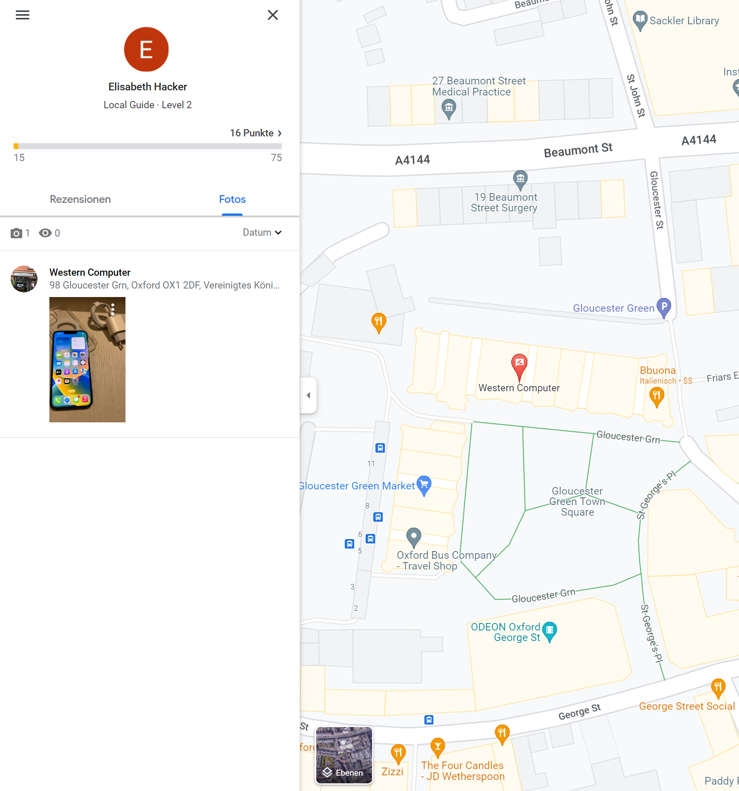

#### Lost connection - Medium

*One of our Neuland members went on a trip to London. I tried to call her a few days ago but she didn't pick up. I am a bit worried as she missed our last meeting as well and we haven't heard back from her. <br>
Can you find out what happened? Here is here email address as the phone number isn't of much use: elisabeth.hacker1337@gmail.com <br>
It would be great if you could tell me the name of the city she is currently in.*

*Flag format: nland{City-name}*

<br>

The only useful information we get from the task description is a Gmail address: elisabeth.hacker1337@gmail.com. We are tasked to find the most recent location of a person. The flag is the city name the person was last in. <br>
Some research on the topic "OSINT" and "Gmail" will reveal the concept of Google IDs. There are several ways to obtain the corresponding Google ID for a Gmail address. You can use G-Hunt or websites like [Epieos](https://epieos.com/) or [Identificator](https://identificator.space/search) to obtain the Google ID. <br>
The Google ID of Elisabeth Hacker is ```114037517009879435623```. The Google ID can be used to access the information of several Google products that are connected to it. As we are looking for a location we will start of with Google Maps. 
The following link can be used to view the Google Maps contributions, reviews and photos of the person with the specified Google ID: https://www.google.com/maps/contrib/google-id <br>
[Here](https://www.google.com/maps/contrib/114037517009879435623/) we can see that she posted a photo at Western Computer in Oxford. It seems like she had troubles with her old phone and had to buy a new one. This explains why we weren't able to contact here.



The flag is `nland{Oxford}`.
