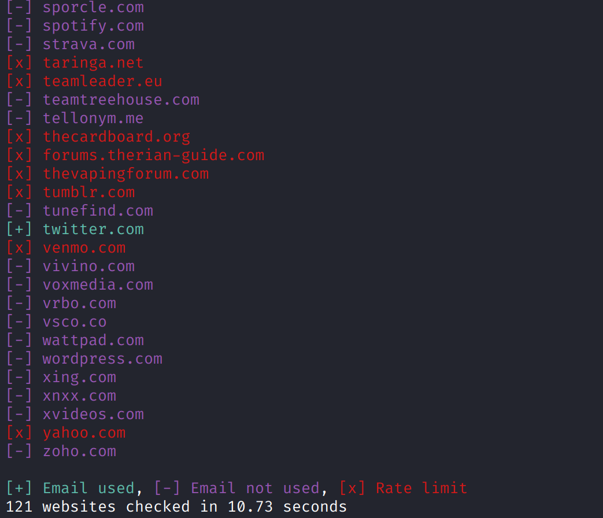
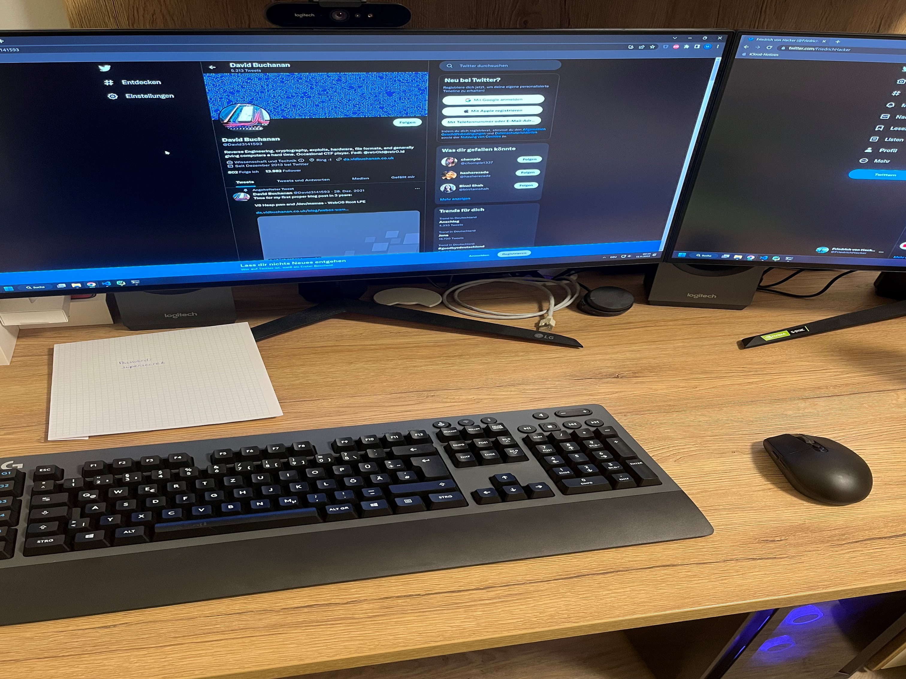
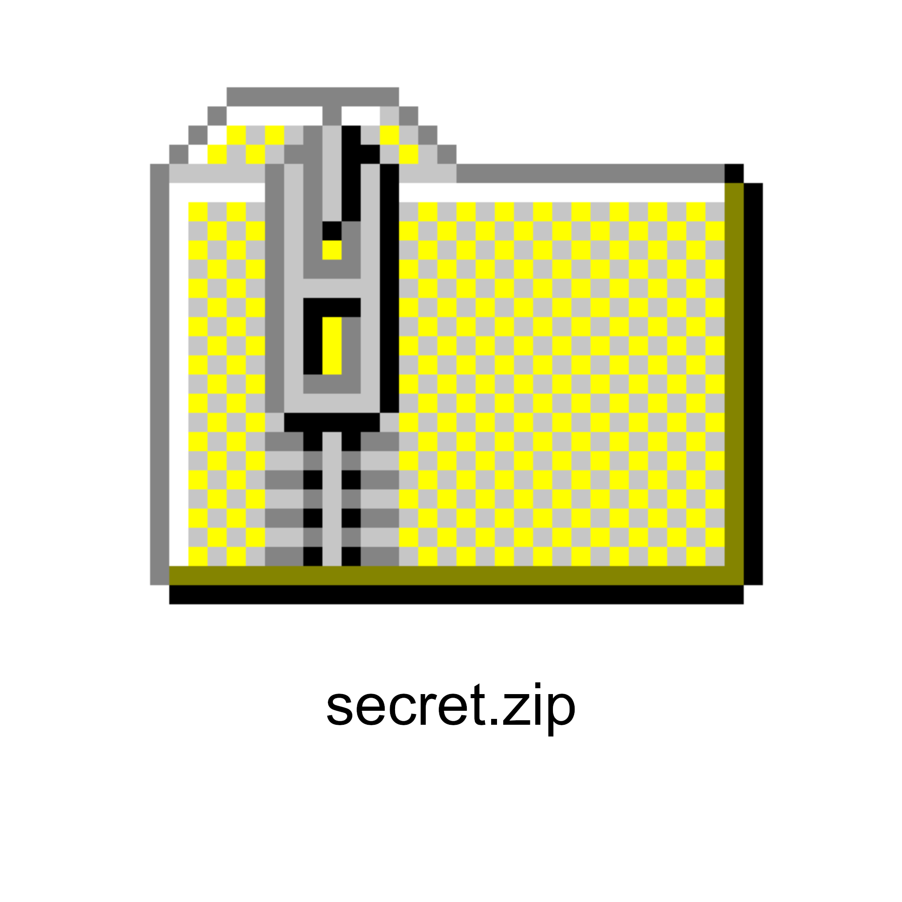

#### Polyglot - Hard

*I received an anonymous, mysterious letter. It told me to look for a Polyglot on my way to find the flag. It also mentioned the following email address: friedrichvonhacker@gmail.com.  
I have no idea where to start. Can you help me?*

 

We will start the challenge with only an email address again. The information from the Google account won't help us this time. There are other ways to perform email OSINT. [Holehe](https://github.com/megadose/holehe) is one of these tools. It allows you to efficiently find the registered accounts from an email address. The output for the provided email looks like this:

This is just a snippet from the output but Twitter is the only website we have a hit. So we head over to Twitter and find the account assigned to the email address `friedrichvonhacker@gmail.com`. Searching for persons with the name `Friedrich von Hacker` we will find [this Twitter account](https://twitter.com/FriedrichHacker). There are quite a few hints that we can find here. The oldest post does show a PC setup. 

The password `supersecret` is written on a paper that is on the desk. The Twitter account of `David Buchanan` is open on the main monitor. The challenge description tells us to look for a Polyglot on the way to find the flag. Polyglot in this context does not refer to the term multilingualism as the second post from `Friedrich von Hacker` might suggest. In computing, a polyglot is a computer program or script written in a valid form of multiple programming languages or file formats. By looking at the [Twitter profile of David Buchanan](https://twitter.com/David3141593) or by searching for `David Buchanan polyglot` you will find [this GitHub repository](https://github.com/DavidBuchanan314/tweetable-polyglot-png). The script allows one to generate a polyglot that can be uploaded to Twitter. As described on the GitHub and in the tweets of David Buchanan we will download the picture form the latest post from `Friedrich von Hacker`. Make sure to download the full sized image. We will end up with this image:

We can change the file extension to `.zip` after we downloaded the file and can try to unzip the [archive](polyglot.zip). It contains the file `flag.txt`. We have to provide a password to unzip the archive. The password `supersecret` that we found earlier will do the job.

The flag is `nland{h0w_d1d_7h15_3nd_up_1n_h3r3?}`.
