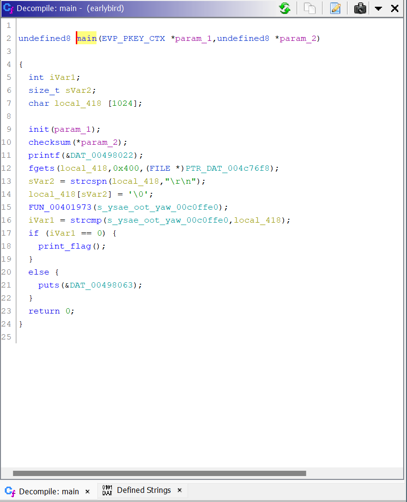
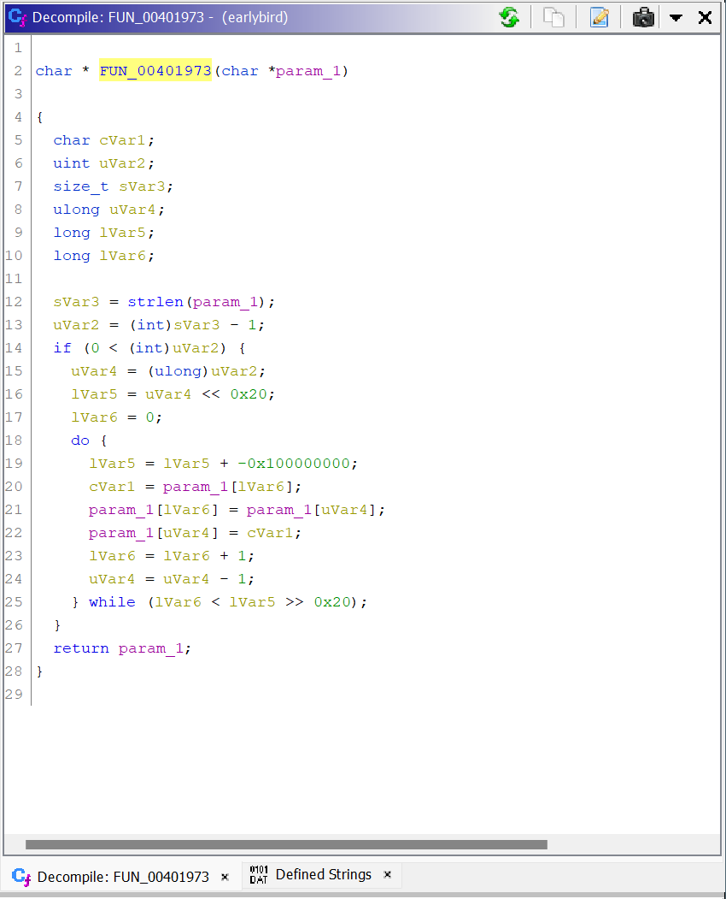
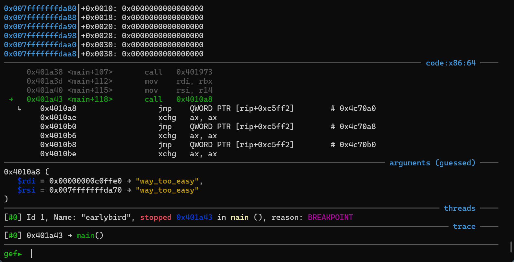
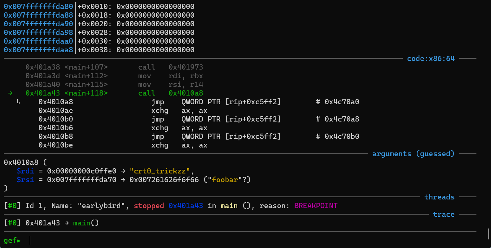
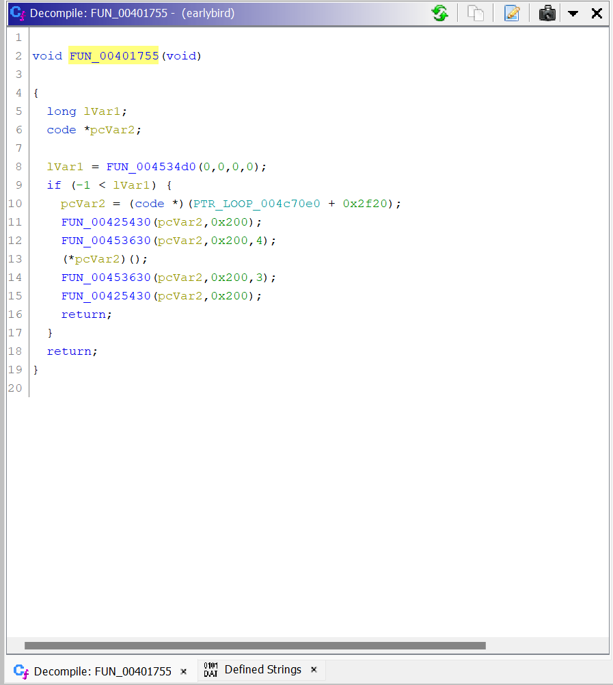

# EarlyBird - Hard
> The early bird catches the baby.
> Author: Dominik Bayerl

This challenge was marked as hard. We get the binary, and a server address to 
connect to. Connecting to the server with f.e. `netcat (1)` greets us with the 
following prompt: 
```bash
integrity: f3ea30e1f4af98a5b805070ce0e8bff50749958bdfcc51047eae911508573f40395a219636daef20d913bb0548b7baef7487beaa035973dab78fbddce61a7e58
Enter password:
🔒
```

If this was a *pwn*-challenge, this would look like something where we have to 
trick the integrity check. Alas, this is reversing, so let's have a look at the 
provided `earlybird` file:
```bash
$ file earlybird
earlybird: ELF 64-bit LSB executable, x86-64, version 1 (GNU/Linux), statically linked, not stripped
```
So, the provided file is a binary file. Since we are security professionals, the 
first thing we do, is run the application we just downloaded from the internet:
```bash
$ ./earlybird 
integrity: f3ea30e1f4af98a5b805070ce0e8bff50749958bdfcc51047eae911508573f40395a219636daef20d913bb0548b7baef7487beaa035973dab78fbddce61a7e58
Enter password:
🔒 foobar
💣 Nice try!
```
OK, so this is interesting. Looks like the server is running the same binary and
we need to input some password. Either the binary is identical (same integrity 
tag), or the author is intentionally screwing with us. Let's assume the first 
option and start reversing!

We are going to use [Ghidra](https://ghidra-sre.org/) for that. After loading 
the binary, and running a initial auto-analysis, we are presented with the 
disassembly listing, and the exported symbols in the "*Exports*"-view on the left.
Ghidra automatically navigates us to the `main()`-function which is obviously 
the entry point of the application. We also get a decompiler listing, which is 
much easier to read than the raw assembly: 



This looks pretty straight forward:
- There is a `init()`-function, which does some weird `iobuf`-stuff 
(*author's note:* this makes the application run well with socat)
- a `checksum()`-function, that prints the ominous checksum line that we saw in 
the netcat-output
- a call to `printf()`, that prompts for the password, which is then read by 
`fgets`
- the input is then trimmed with `strcspn` (very exotic :-))
- and then compared with a string, that is first modified with the 
`FUN_00401973` function. If they are equal, we get flag, else is prints the bomb
icon.

Well, easy. We just have to figure out, what this `FUN_00401973` does to the 
input string `ysae_oot_yaw`:



We can either analyze this manually, dynamically or by using a clever technique 
called [FunctionID](https://blog.threatrack.de/2019/09/20/ghidra-fid-generator/#function-id). 
Turns out, this ia a `strrev`-function, which just reverses the input string. 
Therefore, `ysae_oot_yaw` turns to `way_too_easy` - indeed, that was **way too easy** :-).

Let's use the password and collect the flag: 
```bash
$ ./earlybird 
integrity: f3ea30e1f4af98a5b805070ce0e8bff50749958bdfcc51047eae911508573f40395a219636daef20d913bb0548b7baef7487beaa035973dab78fbddce61a7e58
Enter password:
🔒 way_too_easy
💣 Nice try!
```
😱

It didn't work. But why? We did everything correctly. We can even verify it in 
the debugger!



The `strcmp`-call is obviously correct and we even get the dummyflag. Wait, 
what? We didn't get the flag before. What is happening?

This is where the challenge gets interesting. It behaves differently, when we 
run it in the debugger. There are two options here: either you are familiar with 
anti-debugging techniques and spotted it immediately, or you should freshen up 
your tipps & tricks on malware reversing ;-)

The guide [^1] mentions something about `ptrace` in chapter 4, "Detecting debugging".
Let's test our theory, by tracing the syscalls: 
```bash
$ strace -- ./earlybird
execve("./earlybird", ["./earlybird"], 0x7ffc8f2d6118 /* 41 vars */) = 0
[...]
ptrace(PTRACE_TRACEME)                  = -1 EPERM (Operation not permitted)
[...]
```


With our impressive deduction skills, we have finally caught the criminal. There 
is something fishy going on, where the application somehow detects the attached 
debugger and modifies it's behaviour. There are multiple options here:
- either we try to figure out exactly, where the `ptrace`-syscall is and try to 
figure out our way from there 
- or we just patch away the ptrace and pray to the binary god.

For the sake of this writeup, let's go with the second option. Therefore, 
> Gentlemen, start your ~~engines~~ gdb.
```bash
$ gdb -q earlybird
> catch syscall ptrace
Catchpoint 1 (syscall 'ptrace' [101])
> run
Catchpoint 1 (call to syscall ptrace), 0x000000000045352e in ?? ()
> set $rax = 0
> b *(main+118)
Breakpoint 2 at 0x401a43
> continue
Continuing.

integrity: f3ea30e1f4af98a5b805070ce0e8bff50749958bdfcc51047eae911508573f40395a219636daef20d913bb0548b7baef7487beaa035973dab78fbddce61a7e58
Enter password:
🔒 foobar

Breakpoint 2, 0x0000000000401a43 in main ()
```



And suddenly, the password changed to `crt0_trickzz`? Validating this locally 
confirms that this is the password when running without the debugger. 

Since we are very curious, we want to figure out, how this works. Luckily, gdb 
already gave us the return address for the ptrace-syscall, which is `0x45352e`.
Jumping to this address in Ghidra, we find a somewhat weird function that issues 
the syscall. This is the libc interface (`ptrace`) to the corresponding syscall,
so we need to go deeper and get the calling functions. Ghidra presents those via 
the Xrefs, and indeed, following the first (and only) code Xref, we find a 
function at address `0x401755`.

Ghidra presents us with the following decompiler listing:



The key takeaways here:
- It first checkes the return value of the `ptrace`-stub, and only runs when 
there is no error, i.e. there was no debugger attached
- It then "modifies" somehow (`FUN_00425430`, this is `memfrob(3)`) a data block 
starting at `0x4c70e0 + 0x2f20 = 0x4CA000`. 
- Trying to check this function in Ghidra leaves us confused - it *somehow* 
disassembles, but it's complete nonsense. We can undo the memfrob in Ghidra by 
opening the **Bytes**-view and editing the mangled bytes.
- After unfrobbing the function and instructing Ghidra to decompile at this 
address, we finally find the culprit function. The password (`way_too_easy`) 
gets patched by a code stub that is injected in-memory.
- Applying the XOR-operations manually confirms the password `crt0_trickzz`.


Finally, we can use this alternative password to retrieve the flag from the 
server. The flag is `nland{c47ch35_7h3_w02m}`.

There is one question left: Why did we not see the `ptrace` call in the `main`
disassembly? The answer to this is hinted in the modified password: the 
application uses a special trick, where it runs the modification code **before** 
even the main function, by hooking into the crt0 startup routine. This can also 
be confirmed by checking the Xrefs to the `_entry` and `0x401755`-function. 
This is left as an exercise to the interested reader.

[^1]: Schallner, M. "Beginners guide to basic linux anti anti debugging techniques." Code Breakers Magazine 1 (2006).

