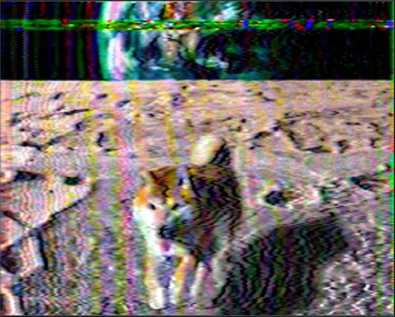
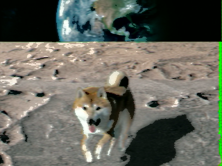

#### Moon transmission - Medium

*I received this transmission from our moon station. The result looks odd. The technology we use for the transmissions is pretty old. It was already used back in the days. It's probably just a disturbance. It has been a long shift for me. So it might as well be me and I did something wrong while decoding. Can you have a look as well and tell me whats wrong with it? Something is out of place.*

*Submit your answer in lowercase and wrapped in nlad{}.*

*Please avoid playing the audio over and over again. It gets a bit annoying. There is a way to get the answer without playing the audio*

<br>

[transmission.wav](transmission.wav)

<br>

Slow Scan TeleVision (SSTV) was used for the transmission. The technology was already used to transmit the footage of the Apollo 11 moon mission. There are a few tools to decode SSTV. Don't worry, the websites are mostly pretty old as well and will look a bit sketchy. There are different SSTV modes. Most tools will allow you to automatically detect the mode so you don't have to worry about it. RX-SSTV for example can be used to decode the WAV file. However, you will have to input the audio through your microphone. This gets a bit annoying if everyone plays the audio. The resulting image also won't have the best qualitity and you will have a hard time to understand the image if there is background noise. Below is the result from RX-SSTV:



The better option is to use this [command line tool](https://github.com/colaclanth/sstv) for example. It allows you to specify the WAV file and simply outputs the image. 

```
$ sstv -d ~/Downloads/transmission.wav -o test.png
[sstv] Searching for calibration header... Found!    
[sstv] Detected SSTV mode Robot 36
[sstv] Decoding image...   [#####################################################################]  99%
[sstv] Reached end of audio whilst decoding.
[sstv] Drawing image data...
[sstv] ...Done!
```

The result looks like this:



We can clearly see that the dog is out of place.

The flag is `nland{dog}`.
