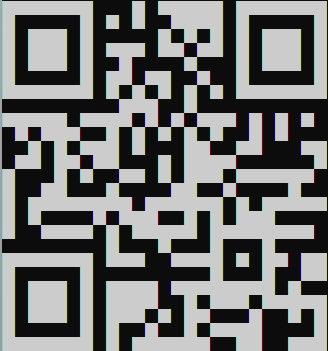

#### Quick response - Easy

*The flag is hidden in the text file.*

 

[quick_response.txt](quick_response.txt)

 

QR code stands for quick response code. That is what the challenge aims for. The text file contains unicode characters that will form a QR code with the right line wrap. Find an editor or a terminal that allows you to adjust the line wrap and play a bit around until you are left with a scannable QR code. The result will look like this:

Scan the QR code and you get the flag.

The flag is `nland{un1c0d3_4r7_15_fun}`.
