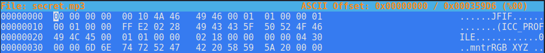
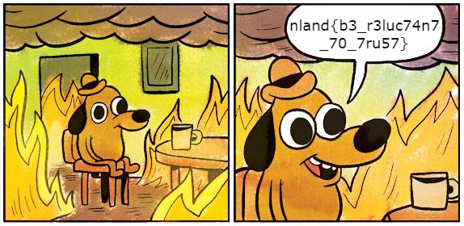

#### Trust issues - Hard

*You might have trust issues after you worked on this challenge. I do not take any responsibility for that.*

*Nothing is like it seems.*

<br>

[dog.png](dog.png)

<br>

You will start the challenge with this cute picture of a dog. 


The standard tools `file`, `exiftools` won't return anything usefull. `Binwalk` and `foremost` will show you that there is a zip file inside the picture. However, they can not extract the zip file correctly as it will be broken. If you finished the OSINT challenge `Polyglot` already or if you have heard about polyglots, you might have another guess here.
Polyglot in this context does not refer to the term multilingualism as you might think. In computing, a polyglot is a computer program or script written in a valid form of multiple programming languages or file formats. `David Buchanan` wrote a script which allows you to combine a zip file with an image and the result will be both a valid image and a zip file. [This](https://github.com/DavidBuchanan314/tweetable-polyglot-png) is the link to his GitHub repository. Simply changing the file extension to `.zip` will do the trick and we have a valid zip file. The zip file contains one file called `secret.mp3`. The archive is password protected. There are no hints to guess the password. We will have to start brute forcing. `Fcrackzip` won't work here as it does not recognice the polyglot zip file as a valid zip. We can use `John` to crack the zip.

```
zip2john dog.zip > hash.txt
```

```
john --wordlist=/usr/share/wordlists/rockyou.txt hash.txt
```

The password is `ITRUSTNO1`. <br>
Now we can extract the `secret.mp3`. It is not a valid mp3. Opening `secret.mp3` in a hexeditor we can see that the first bytes are set to zero followed by the hex representation of JFIF. 



This leads to the assumption that this should be a JPG file. We can replace the 0s at the start of the file with the magic bytes of a JPG file: `FF D8 FF E0`. Then we can rename the file extension to jpg. Once we are done with all of that we are presented with another image:



The flag is `nland{b3_r3luc74n7_70_7ru57}`.
