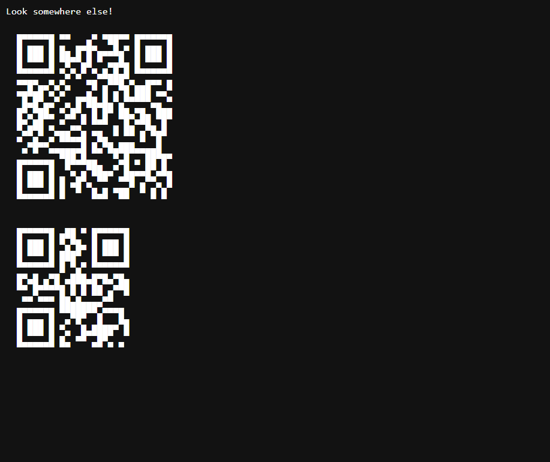
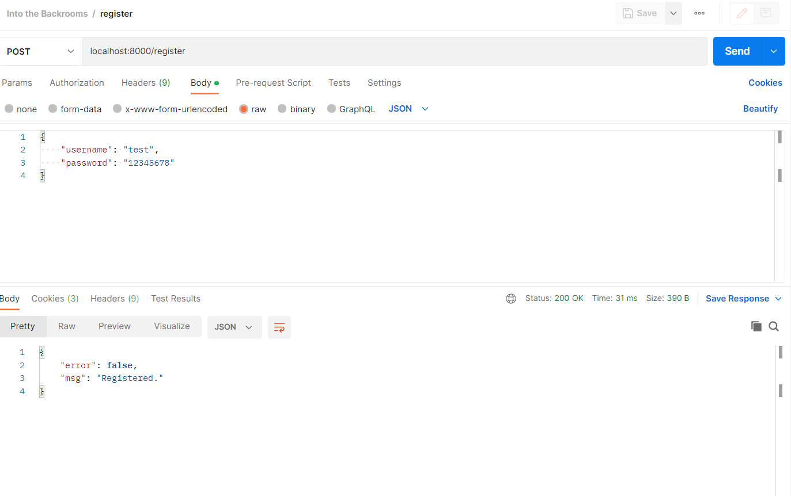
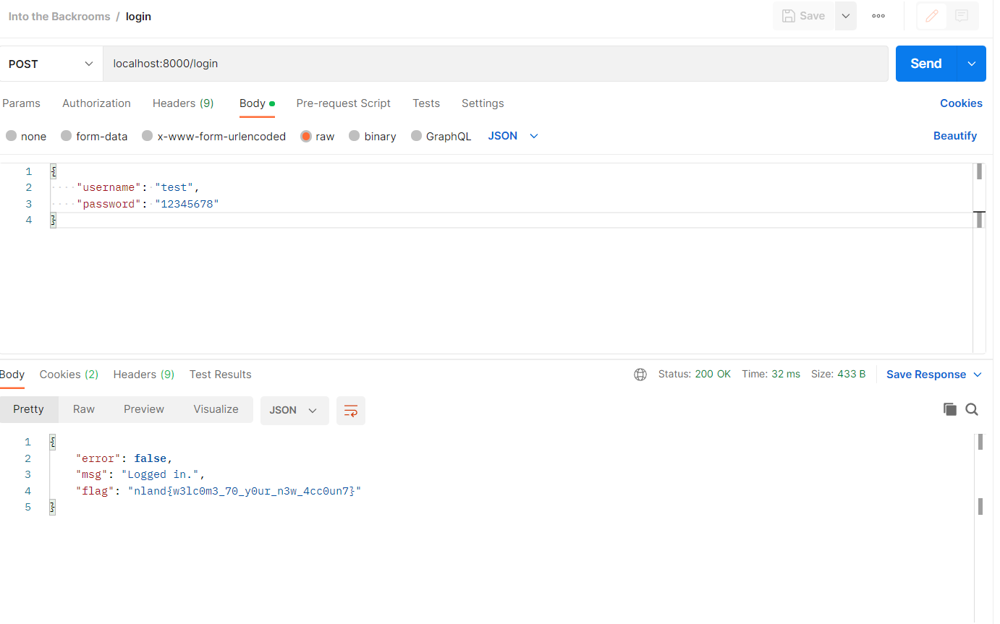

#### Into the Backrooms 1 - Easy

*This challenge has four different parts. The source code is always the same. The parts build on each other and you should work on them in their order.

I am currently working on the backend of a new shop system. It is still in development and not finished. Have a look for yourself and try to log into an account.*

*Connection information: <br>
*hostname:8085*

<br>

[into_the_backrooms.zip](../../Public/into_the_backrooms.zip)

<br>

We are presented with the backend of a shop system. The frontend isn't of much use. There are two QR codes and the message to "Look somewhere else!". We only get rickrolled if we scan the first QR code. 



As already expected we have to focus on the backend. For this sake I am going to use Postman to send the requests. The task tells us to log into an account. We have to register a new account and log into it.

From the following piece of code we can see that we need to send a post request to the endpoint `/register`. 

```js
api.post('/register', (req, res) => {
	let reqUser = req.body.username
	let reqPwd = req.body.password

	if(!reqUser || !reqPwd)
		return res.json({ error: true, msg: "Missing parameters." })
    ...
})

```

In the body we need to include a username and password. This line tells us to format the body as a json: `api.use(bodyParser.json())` 
The final request in Postman looks like this:



If we used a unique username, we get back the response that we are registered and two cookies are set.
* uid --> user id of the account
* passwd --> hashed password of the account

To login we can use the same request and sent it to the endpoint `/login`.



The response does contain the first flag.

The flag is `nland{w3lc0m3_70_y0ur_n3w_4cc0un7}`.
