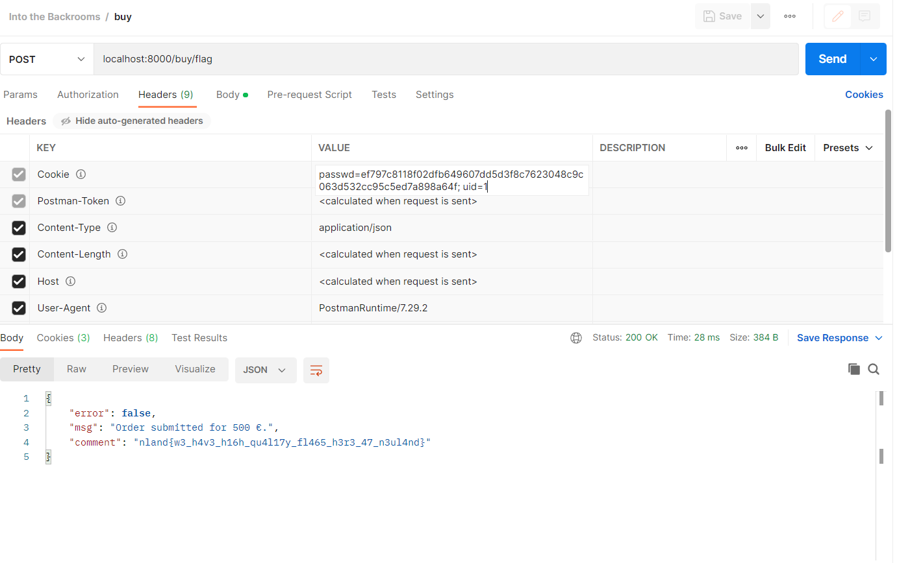

#### Into the Backrooms 2 - Medium

*This challenge has four different parts. The source code is always the same. The parts build on each other and you should work on them in their order.

Once you are logged in it is also possible to buy stuff. Have a look at our offers.*

*Connection information: <br>
*hostname:8085*

<br>

[into_the_backrooms.zip](../../Public/into_the_backrooms.zip)

<br>

Once you have finished the first part of the challenge you should know how to register a new account and how to log into it. If you are logged in, you are able to buy products. The shop has stickers, T-shirts and flags in stock. Of course we want to buy a flag as it does set the flag as a comment. The relevant code can be seen below:

```js
api.post('/buy/:article', (req, res) => {
	if(req.userUid == -1)
		return res.json({ error: true, msg: "Login first." })

	let article = req.params.article
	let err = null
	let comment = ''

	if(!req.body.quantity || !req.body.price)
		err = "Missing parameters."

	if(article == "t-shirt") {
			comment = "You will receive a T-shirt after the CTF."
	} else if(article == "sticker") {
			comment = "You can grab some stickers from the desk at the front."
	} else if(article == "flag") {
			comment = flag2
	} else err = "Product not in stock."

	if(err)
		return res.json({ error: true, msg: err})

	let total = req.body.quantity * req.body.price
	res.cookie('order',`${req.userOrder},${total}`)
	res.json({ error: false, msg: "Order submitted for " + total.toString() + " €.", comment: comment })
})
```

We need to send a post request to the endpoint `/buy/flag`. The body needs to contain a JSON with the fields `quantity` and `price`. The two cookies passwd and uid need to be set as well to the values of the created account. The response will then contain a comment with the second flag. An `order` cookie is set with the response as well.



The flag is `nland{w3lc0m3_70_y0ur_n3w_4cc0un7}`.
