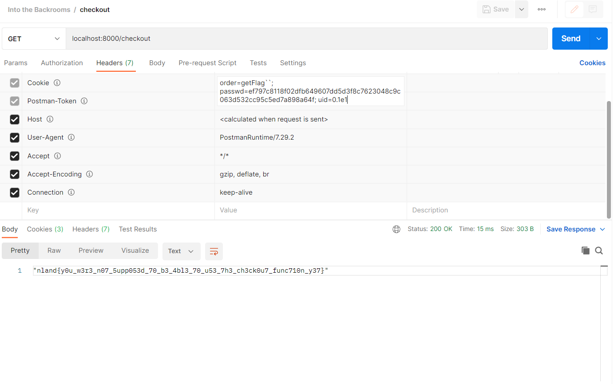

#### Into the Backrooms 3 - Hard

*This challenge has four different parts. The source code is always the same. The parts build on each other and you should work on them in their order.

The checkout function is still under development. Only the admin account is allowed to use it for testing. Don't even try to find a loophole and to dig deeper.*

*Connection information: <br>
*hostname:8085*

<br>

[into_the_backrooms.zip](../../Public/into_the_backrooms.zip)

<br>

The third part of this challenge series is already a lot trickier. We need to use the admin account with uid 0 to be able to use the checkout function. 

```js
api.get('/checkout', (req, res) => {
	...
	if(parseInt(req.userUid) != 0 || req.userOrder.includes("("))
		return res.json({ error: true, msg: "You are not allowed to do this. Checkout function is still in testing." })
    ...
```

However, we don't have access to it. We have control over the `uid` cookie and can change it to whatever value we want. We need to know the password of the account the uid belongs to to be able to log into the account. This means we can't just change the uid to the admin account as well. We are also not able to find the password of the account or to hijack the cookies. However, there is a small detail in the authentification process that we can abuse. 

Authentification process:
```js
api.use((req, res, next) => {
	req.userUid = -1
	req.userOrder = ""

	let order = req.cookies.order
	let uid = req.cookies.uid
	let passwd = req.cookies.passwd

	if(uid == undefined || passwd == undefined)
		return next()

	let found = false
	for(let user of users.entries())
		if(user[0].uid == uid && user[0].password == passwd)
			found = true

	if(found) {
		req.userUid = uid
		if(order != undefined)
			req.userOrder = order
	}

	next()
})
```

The uid cookie is sent to the backend as a string. During the comparission with a number in the authentification process the type of the string is being juggled into a number. 

The admin validation in the checkout function does use the parseInt() function to change the string into a number.

```js
if(parseInt(req.uid) != 0 || req.userOrder.includes("("))
```

We can exploit this. We need to find a number which is equal to 0 if passed to parseInt as a string. At the same time the number must be equal to our uid as well when being juggled to a number during the authentification process. Can we find such a number? <br>

The scientific notation or e notation will be helpful here. It is used to express extremely large or small numbers. The number 1,000,000 can be written as 1 * 10<sup>6</sup> or 1e6. We can convert any number to scientific notation and they will evaluate to the same number. If the uid of our registered account is 1, we can represent it as 0.1e1. We can change the value of the uid cookie to this value and we will still be able to log in. The uid value in the cookie will be passed as a string. The authentification middleware function will still allow us to log in as "0.1e1" == 1.

```js
if(user[0].uid == uid && user[0].password == passwd)  // 1 == "0.1e1"
```

The uid for the requests will then be set to the provided value "0.1e1".

The admin validation for the checkout function is coded differently as already mentioned.
```js
if(parseInt(req.uid) != 0 || req.userOrder.includes("(")) // parseInt("0.1e1") == 0
```

parseInt() will evalutate the string value of our uid to 0. This allows us to bypass the admin validation and we can still user our created account.
To sum things up: We can change to value of the uid cookie to `uid=0.1e1` and then we will be able to bypass the admin validation. You will have to change the value accourdingly as you will most likely have a different uid. You have to convert your original uid into scientific notation with a leading zero. A uid of 27 would be set to 0.27e2.

Now we are able to use the checkout function.

The checkout function contains a sandbox that allows us to execute code.

```js
result = new String(test_env.run(`sum([${req.userOrder}])`))
```

We have control over the `userOrder` cookie and therefore can change it to execute a command. The cookie can not contain the character `(`. We need to find a way to call functions without the parentheses. Tagged template literals can be used to execute a function on a string. This allows us to call our function without the parentheses. 

```js
console.log`Hello world!`
getFlag``
```

We need to send a get request to the endpoint `/checkout` with the cookies `uid`, `passwd` and `order`. 
`uid` needs to be set the scientific notation of the user id of our account starting with a leading zero.
`passwd` needs to be the hashed password ouf our account.
`order` needs to include the function we want to execute. In this case we want to set the value to ` getFlag`` ` to execute the function. It will return the third flag.

The final request will look like this:



The flag is `nland{y0u_w3r3_n07_5upp053d_70_b3_4bl3_70_u53_7h3_ch3ck0u7_func710n_y37}`.
